# Soft Landing Manager script for the game Space Engineers

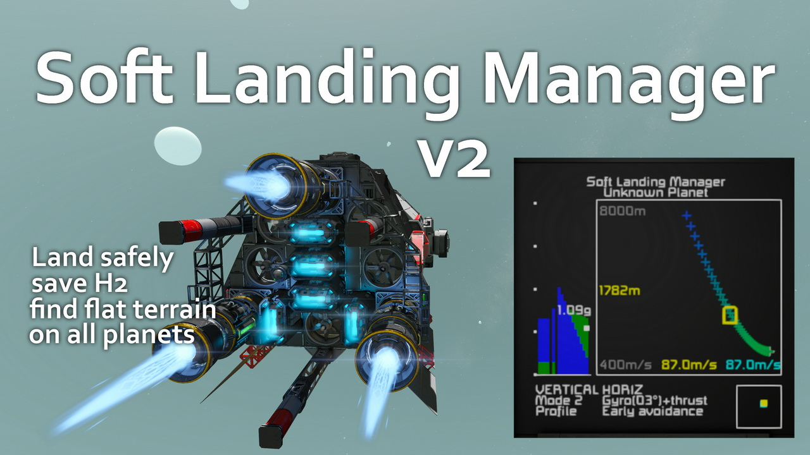

A script to automatically manage your thrusters to land safely on planets while optimizing your fuel and energy use. Also scans the terrain and guides the ship to a safe landing spot, avoiding obstacles and steep slopes.

It uses an acceleration model of the ship, with a planet gravity and atmosphere model (as used by the game, not real-life !), to compute the ideal landing profile (speed vs altitude).
This heavily relies on the planet gravity extending away to a long distance from the surface and following an inverse square law, which is not what the game natively does, hence why the mod Real Orbit is required (and a speed mod to let the ship move faster than 100 m/s and make things even more interesting).

## Summary

### Designed for use with:
- inverse square law gravity mods such as Real Orbits
- high speed limit mods such as 1000 m/s speed mod
If you're not using both of these, then the script won't work well but also is not really needed.
- ships with not a lof of margin for vertical thrust (ex : lift to weight ratio of 1.5)

### Functions:
- computes and follows an optimal vertical speed profile for the descent
- prioritizes electric thrusters (atmospheric and ion) before using hydrogen ones, to save on H2
- uses a radar (raycasts from a downward facing camera) to measure your altitude way above what the game normally provides (useful for planets with gravity extending more than 100km from them!)
- (new in v2) keeps your ship level (copy of Flight Assist "Hover Smart" mode)
- (new in v2) scans the terrain below the ship and guides it down the slopes to find flat terrain for a safe landing
- (updated in v2) computes and show the maximum gravity that your ship can handle for all atmosphere densities
- provides an estimate of the surface gravity for the planet
- warns if the ship is not capable of landing on the planet
- automatically deploy parachutes if about to crash

### Installation:
- (optional but recommanded) install one or two downwards facing camera on your ship, with the proper tag in their names
- (optional but recommanded) configure the names of the ship controller (cockpit, helm etc.)
- (optional) configure LCDs, timers, sound blocks etc. as needed, see below for the functions they provide
- install the script in a programmable block
- recompile the script to let it autoconfigure itself
- (no longer needed with v2) ~~Install and configure on your ship an auto-levelling script such as flight assist or other~~ 

### Basic usage:
- Move your ship to the edge of a planet gravity field
- Activate mode1 or mode2 to have the script manage your descent
- (optionnally) Set vacuum or atmosphere mode, or select a planet to optimize the descent profile
- Steer your ship to land on flat ground or let it manage it automatically (you can provide inputs at any time that will override automatic horizontal guidance)
- Once landed, check if the script automatically switched to mode0 (off), if not then turn it off yourself

### Command line arguments:

Basic commands

- **off** : turns the script off (the LCDs still give you information about your ship capabilities)
- **mode1** : activate a descent mode that prioritizes electric thrusters (atmospheric and ions)
	It fires the ion thrusters early to bleed the gravitational potential energy and reduce the work left for the hydrogen thrusters. However this uses more total electrical energy than mode2
- **mode2** : activate a faster descent mode that fires thrusters only when needed
	It is possible to switch between mode1 and mode2 during the descent, for example use mode2 to
	let the ship pick up speed, and then switch to mode1 to try and maintain that speed using ion thrusters
- **mode3** : the script only manages autoleveling (copy of Flight Assist "Hover Smart" mode)

Advanced commands : planet surface conditions

- **vacuum** : expect vacuum at the planet surface (atmo thrusters won't work, max ion efficiency)
- **atmo** : expect atmosphere at the planet surface (atmo thrusters will work, low ion efficiency)
- **unknown** : tells the script that the surface atmosphere conditions are unknown (default setting), the script will consider the worst-case scenario considering the thruster mix of your ship
- **earth**, **mars**, **pertam** etc. : optimize the script for the selected planet from the catalog

Advanced commands : guidance during descent for terrain avoidance

- **angleoff**, **angleon** and **angleswitch** configure whether terrain avoidance will tilt the ship to manage horizontal speed or not
- **thrustersoff**, **thrusterson** and **thrustersswitch** same for the forward/back/left/right thrusters

Advanced commands : other

- **leveloff**, **levelon** and **levelswitch** same for the forward/back/left/right thrusters

All commands can be combined, ex : **mode1mars**, **mode2atmo**, **mode1angleoffthrusterson** etc.

## Detailed user manual

### Ship configuration

Use the following names for your ship blocks. They may be changed in the script configuration (`SLMShipConfiguration` class).

*SLMref* RECOMMANDED : Reference controller (seat, cockpit, etc.) to use for the ship orientation. This is optional, if the script doesn't find a controller with this name then it tries to find another suitable controller on the grid and uses the first one available, which may be in the wrong orientation.

*SLMradar* OPTIONAL BUT RECOMMANDED : Name of downward-facing camera used as a ground radar (to measure altitude from very long distance and also account for landing pads above or below a planet surface). It is recommanded to have two of them and they need to have unobstructed view below the ship with a wide angle of view (there must be no ship parts in a cone of 45° angle starting at the camera)

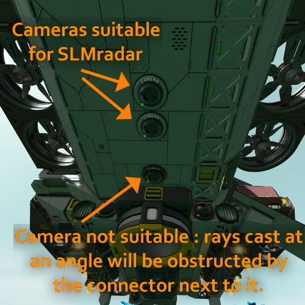

*SLMignore* OPTIONAL : Include this tag in any block that you want this script to ignore. For example, thrusters on an auxiliary drone.

*SLMdisplay* OPTIONAL : Main display for the script (there can be any number of them, or none at all)

*SLMdebug* OPTIONAL : Additional debug display for the script (there can be any number of them, or none at all)

*SLMlanding* OPTIONAL : Timer blocks that will be triggered a little before landing (ex : extend landing gear)

*SLMliftoff* OPTIONAL : Timer blocks that will be triggered a little after liftoff landing (ex : retract landing gear)

*SLMon* OPTIONAL : Timer blocks that will be triggered when the SLM activates (ex : by the command "mode1")

*SLMoff* OPTIONAL : Timer blocks that will be triggered when the SLM disactivates (ex : by the command "off", or at landing)

*SLMsound* OPTIONAL : Sound block used to warn if expected surface gravity is higher than what the ship can handle or the ship is in panic mode (incapable of slowing down enough)

### Script configuration

Speed limits, thrust-to-weight ratio margins, PID controller coefficients, timer trigger altitude etc. can be changed in the `SLMConfiguration` class (see code and [technical documentation](technical.md)).

### Planet catalog

All vanilla planets are included. Modded planets can be added to the *PlanetCatalog* class (see code and [technical documentation](technical.md)).

### Display description

#### General disposition

The script provides all necessary information on one display layout shown below, with five main parts:

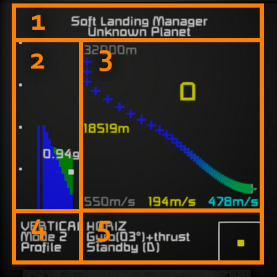

1. Header showing the planet parameters currently used
2. Vertical thrust and planet atmosphere and gravity indicator
3. Landing profile graph with current altitude and vertical speed
4. Vertical mode indication
5. Horizontal mode indication with horizontal speed visualisation

The next chapters detail each part.
#### 1 : Header

The header shows the name of the script and planet parameters currently used. It can be :
- unknown
- generic atmospheric or generic vacuum
- the precise name of a planet that you selected in the catalog

#### 2 : Vertical thrust and planet atmosphere and gravity indicator

This combines several pieces of information on a vertical scale representing vertical acceleration

From left to right, it shows:
- dots to show the scale, one dot = 1 G (9.81 m/s²)
- a wide bar that shows the thrust that the ship is currently applying (visible in the image below), color-coded by thruster type : green for atmospheric, blue for ion, red for hydrogen
- a thin bar that shows the maximum thrust that the ship is capable of applying right now (for ion and atmospheric, it depends on the atmosphere density around the ship)
- a representation of that ship capability for all possible atmospheric densities, from pure vacuum on the left to 100% atmospheric pressure on the right, with the same color coding

When the script manages landing, it shows also a white dot :
- the vertical position of the dot corresponds to the estimation of the planet surface gravity (the exact value is written above)
- the horizontal position of the dot corresponds to the atmospheric density that the script is considering to compute landing parameters

If the estimated surface gravity is too much for the ship to handle, it is shown in red, as on the following example.

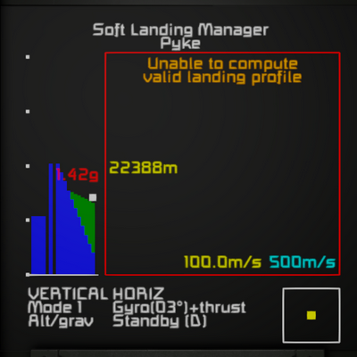

On the above, you can see that the shis is capable of thrusting approximately 2g in vacuum (using the ion thrusters fully), and approx. 1,4g in atmospheric conditions (with ion thrusters at low efficiency and atmospheric thruster that offset some of that missing capability). We're currently thrusting the ion thrusters at around half power. The user configured the script for planet Pyke, therefore the script knows that surface conditions are 1.42g with an atmosphere, which is a bit above what the ship can handle, hence the red color.

#### 3 : Landing profile graph with current altitude and vertical speed

This graph represents the landing altitude/speed profile that the script computed and will be following during the descent. The vertical axis shows altitude, and the horizontal axis shows vertical speed (faster on the left, slower on the right). Note that all vertical speeds are shown with a *positive* sign when *descending*.

The profile therefore should look like some kind of diagonal, from the top left (high altitude, high speed) to the bottom right (low altitude above the ground, low vertical speed).

The color of the graph is based on the mix of thruster types that the script expects to use at this point. If your ship has various types of thrusters, expect to see a gradient of color as the capabilities evolve with the altitude.

A yellow box shows the ship current altitude and vertical speed on the same graph. 
- if the yellow box is above the graph, the ship does not need to start the braking burn yet
- during the braking burn, the yellow box should follow along the profile
- if the yellow box is below the graph, that's a bad sign ! The ship is moving too fast compared to what the script considers safe

If the ship is going much too fast too low, it triggers the panic display, and the script will attempt to deploy parachutes.

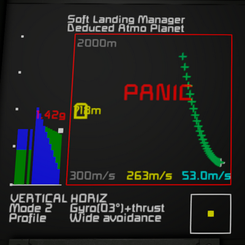

The exact value of the ship altitude and vertical speeds are also shown in yellow. The speed set-point (desired value computed by the script) in shown in light blue.

Gray values show the current scale for altitude and speed shown on the graph (the bottom right is always zero altitude and zero speed).

If your ship uses hydrogen thrusters, the top right corner gives an estimate of what will remain in your tanks after you've landed. In the example below, the ship started with tanks 100% full, so the whole landing is expected to use 4% of the total.

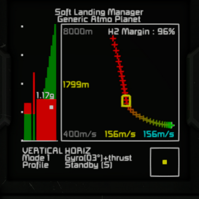

When the script is off (mode 0), this area still shows the current speed and altitude, and also the ship name and total mass.

The border around the graph turns left in a few alarming situations, mostly when the ship is unable to follow the profile or expected to be unable to land. It may sometimes turn red for a second or two before recovering thanks to small margins in the design.

Note that in the above illustration this is another ship which is much more capable in atmospheric conditions, but can only do around 1.3g in pure vacuum.

#### 4 : Vertical mode indication

This shows you two lines of information:
- what mode is currently active
- what is the source used to control the descent speed

Possible states for the source are :
- **Profile** : this is the most accurate
- **Alt/grav** : an approximation using only altitude and gravity. It's only used when the profile is not computed yet or cannot be computed (usually a bad sign)
- **Gravity** : a temporary formula used until the altitude is known
- **Final** : constant speed for the final few meters above ground
- **Disabled** : landing management is not active

Typically, as the script starts up and initializes, you'll see this sequence : **Disabled** > **Gravity** > **Alt/grav** > **Profile** > **Final**.

#### 5 : Horizontal mode indication with horizontal speed visualisation

This also shows you two lines of information:
- what means the script uses to manage horizontal speed, between gyroscopes (showing you the maximum angle that it will tilt the ship) and/or thrusters
- what mode is currently active for terrain scanning and slope avoidance

For terrain scanning and slope avoidance, the state can be :
- **No avoidance** : script inactive, or the ship has no radar, or disabled by configuration or user command
- **Standby (S)** : the ship has only one radar, the altitude is still to high to scan the terrain
- **Simple avoidance** : the ship has only one radar, a basic scanning pattern is active
- **Standby (D)** : the ship has two radars, the altitude is still to high to scan the terrain
- **Early avoidance** : with two radars, a simple scanning patters can be started early, high above ground
- **Wide avoidance** : with two radars and close to the ground, a more elaborate scanning pattern is active

If the ship has a single radar, you'll see the sequence : **No avoidance** > **Standby (S)** > **Simple avoidance**.

If the ship has two radars, you'll see the sequence : **No avoidance** > **Standby (D)** > **Early avoidance** > **Wide avoidance**.

In addition, at the bottom right a small square shows graphically the ship horizontal speed (max 20 m/s):
- The yellow dot is the current speed
- The blue dot is the speed set-point, decided by the terrain avoidance function to guide the ship to lower, flat ground

You can see an example here :

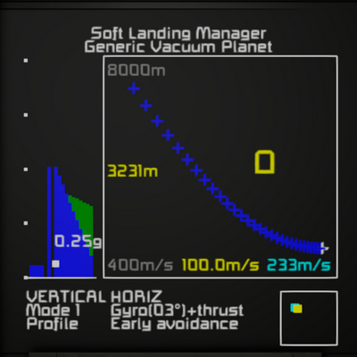

If a warning sign appears, that means that view from the radar (ground-facing camera) is obstructed by the ship itself and cannot properly scan the terrain in at least some directions. You can see an example here :

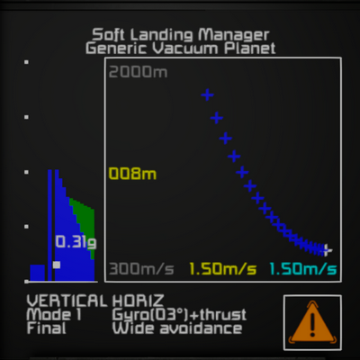

## FAQ/Troubleshooting

#### Does it really need Real Orbits and a speed mod ?
If you don't use these, the game is much easier and you probably don't really need the script. To be honest, I don't know, I haven't tested with vanilla Space Engineers.

#### I have an issue and want to ask for help
Sure, but please help me help you. Give details to what is wrong, when it happens. Tell me or show screenshots of how your ship is set up, what the script says (in the menu for the programmable block, see below) when you compile it, what is shown on the main displays (LCD named "SLMdisplay") etc.

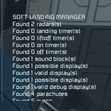
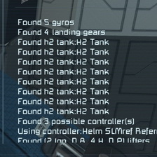
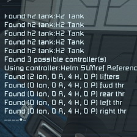

#### The script does not align the ship correctly
The script manages orientation based the ship controller it is using. Look at what the script says (in the programmable block window) when you compile it. Does it say "Found a ship controller:" or "Using configured controller:" and if so, is the controller name the one you expect ? You can add "SLMref" in the name of the block to make sure the script uses the one you want, or modify the name "SLMref" in the code configuration to the name of the ship controller you want to use.

#### The script does not detect/use the thrusters correctly
The script detects and uses thrusters relative to the orientation of the ship controller. See above.
Use the programmable block display (as shown above) to see what thrusters are detected (Ion, Atmo, Hydro) for each direction. Thrusters used to go "up" are called "lifters" here.

#### The landing profile keeps changing, the landing burn is not smooth
Yes, it's recomputed in real time as the script updates its estimate of the planet radius, surface gravity, and atmosphere condition. If you can select an exact planet in the catalog, it will be much more stable.

#### The script doesn't turn off after landing
Tweak the `altitudeOffset` configuration parameter so that the ship reads less than 2m altitude when you've landed. Alternatively, have a landing gear/magnetic plate on autolock, and the script will turn off when it locks.

#### The ship slammed into a mounted/got stuck into a canyon/landed crooked etc. despite the terrain avoidance feature
Yes, it's far from perfect because of the limitations in camera raycast details and update rate. There is also a lot of tweaking/tuning remaining to be done so that it works well for all ship shapes and sizes. Remember that you are still in control of the ship and can orient the ship and apply horizontal thrusters yourself even when the script is running in terrain avoidance mode. It will let you have authority as long a you provide inputs, and takes over again after a few seconds.

#### It barely tilts/tilts dangerously the ship for horizontal guidance
The script estimates the safe tilt angle based on the ship rotational inertia and the number of gyroscopes. I still need to find the ideal settings. At the moment, it's probably too much on the safe side !

#### I don't want the terrain avoidance function ! It was better before
It's possible to disable it using the command arguments (see above) but to be less annoying, change both `terrainAvoidGyro = true;` and `terrainAvoidThrusters = true;` to `false` in the `SLMConfiguration` class, so that it starts disabled by default.

#### The script makes the game lag
Yes, I've noticed some spikes in the script execution time (>1ms) for the terrain scanning function. It's under investigation.

#### The script went in panic mode but did not deploy parachutes and my ship crashed !
Look at the parachutes block, it's probably in the "deploy" state but didn't deploy. Check if they have canvas in them. I've sometimes found the parachute blocks unreliable in SE (they don't detect the atmosphere and don't open).

#### How to add more planets to the catalog ?
Modded planets can be added to the `PlanetCatalog` class (see code and [technical documentation](technical.md)).

#### How to add custom thrusters ?
The constructor of the `ThrGroup` class looks at the thrusters `DefinitionDisplayNameText` to classify them in atmospheric/ion/hydrogen groups. You may add more names there (see code and §11.2 of the  [technical documentation](technical.md)).
