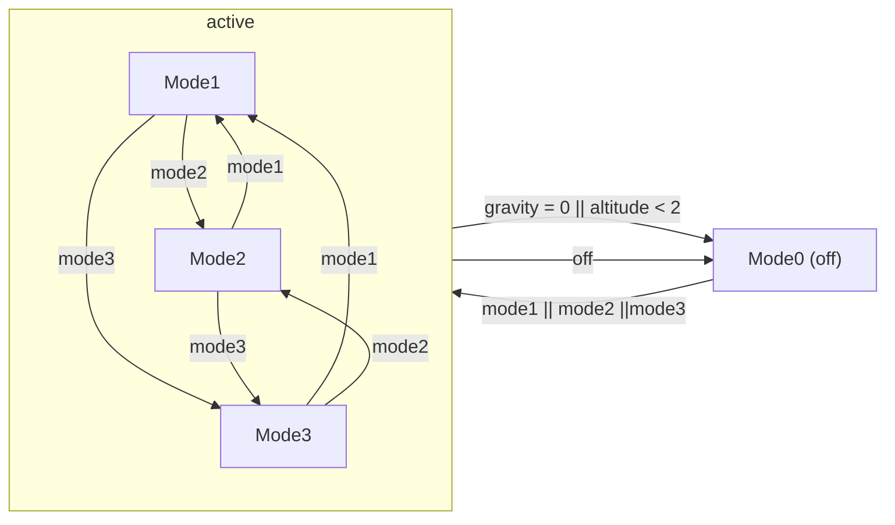

# Landing Manager

## Modes management

## Selection of the speed set-point

|Altitude							|Landing Profile			|Method                                         |
|-----------------------------------|---------------------------|-----------------------------------------------|
|available & above transition		|computed & valid			|Profile computed from Liftoff Profile Builder  |
|available & above transition		|not computed or not valid	|Altitude/gravity formula                       |
|available & below transition		|-							|Constant final speed                           |
|not available						|-							|back-up formula simply using the local gravity |

### Speed set-point explicit formula
The formula for the speed set-point is derived assuming a time-reversed take-off with constant acceleration

Newton formula : 

$mass * acceleration = forces$\
$forces = lift - weight$\
$weight = mass * gravity$

Divide by mass:

$acceleration = \frac{lift}{mass} - gravity$\
$acceleration = (\frac{lift}{weight} - 1)*gravity$

If initial altitude and speed are zero, and we assume acceleration is constant:

$speed = acceleration * time$\
$altitude = 1/2 * acceleration * time^2$

Then solve for time as a function of altitude

$time = \sqrt{2 * \frac{altitude}{acceleration}}$
		
Substitude for time in the speed formula:

$speed = acceleration * \sqrt{2*\frac{altitude}{acceleration}}$\
$speed = \sqrt{2 * altitude * acceleration}$

Finally :

$speed = \sqrt{2 * altitude * (\frac{lift}{weight} - 1)*gravity}$

Because gravity, lift and weight are not actually constant, this formula provides an approximation
that is more and more incorrect at high altitude and thus margins must be applied here and there so
that the ship is capable of following the changes in the set-point

### Gravity formula

$vspeed_{sp} = -\frac{default}{grav_{now}/9.81}*(LWR_{target_{now}}-1)$

## Selection of the altitude

Update ship altitude (distance from surface) by combining altitude from controller (as shown on HUD) and radar (raytracing from ground-facing camera) as follows:

|Altitude from controller|Altitude from radar|Method                   |
|------------------------|-------------------|-------------------------|
|available 				 |available		     |Use radar altitude       |
|available 				 |not available      |Use altitude from surface|
|not available			 |available			 |Use radar altitude       |
|not available			 |not available		 |default value (1e6)      |

## ComputeLWRTarget

Compute the lift to weight ratio that will be used to compute the vertical speed set-point :
In mode 1:
- Only electric thrusters when they are sufficient
- All thrusters when needed
- Progressive transition between

In other modes:
- Allways all thrusters

## ComputeSurfaceGravityEstimate

If the pilot selected the planet from the database, it's easy !
Otherwise, we have to use the estimator

First, we compute a ground estimate, weighted with the estimator confidence (low confidence means we use some proportion of the current gravity)

# GroundRadar

## Justification for the terrain scan distance :

The camera raycast charge rate is 2km/s
If called with tick10 (6 times per second), each tick lets us scan 2000/6 = 333m

### 1) With a single radar

If we have a single radar, it will be used for both altitude and terrain
	
The altitude scan has priority and will use all available scan range above an altitude X when X+RANGE_INCREMENT = 333m

Below that, we will accumulate $333m - (alt+RANGE_INCREMENT)$ of range per tick to scan for terrain.

A terrain scan that begins Y meters above the ground and with a range of Y meters uses 4 scans, therefore uses 4 x Y meters of range.

The maximum number of ticks between each terrain scan is therefore $\frac{4*Y}{ (333m - (Y+RANGE_INCREMENT))}$

For range increment of 50m, and Y=180m, that is:
4*180 / (333 - (180+50)) = 4*180 / 103 = 6.9 ticks
This is almost one per second, and sufficient

### 2) With two radars

If we have two radars, the first one will be used for altitude and the second one is entirely dedicated for terrain.

The maximum number of ticks between each terrain scan is therefore  4*Y / 333m
For Y = 400m that is 4*400 / 333 = 4.8 ticks

# LiftoffProfileBuilder

A landing profile has two attribues :
- computed : if the profile has been computed or not
- valid    : if the computed profile concludes on a successfull liftoff, meaning that the vertical speed is always positive.

If the profile is computed but invalid, that means the ship is not capable
of exiting the planet gravity well. It is however possible that the ship is capable of landing safely (ex : with a lot of atmopheric thrusters) but this landing profile cannot be used to control landing and a backup method will be needed.

Steps for computation are:
- Initial conditions : 0 vertical speed, altitude = ship at the surface
- Compute atmospheric density using the same simplified model as the game
- Compute the ship maximum lift from ion and atmospheric thrusters considering that density
- Compute the ship maximum lift from hydrogen thrusters
- If necessary, limit the total thrust according to configured acceleration and TWR limits (cut back on hydrogen first)
- Compute gravity using the same simplified model as the game
- Compute ship vertical acceleration : thrust/weight - gravity
- Compute ship vertical speed for some time step dt
- Compute the new ship altitude for some time step dt
- Repeat for 256 points

Then we use the altitude/speed table to interpolate (using binary search and linear interpolation) the speed set-point for any altitude value.

# EarlySurfaceGravityEstimator

In Space Engineers (with the Real Orbits mod!) gravity works as follows:
- below $radius * hillparam$
  
$$
grav(alt_{sealevel}) = grav_{sealevel} ;
$$

- above $radius * hillparam$
  
$$
grav(alt_{sealevel}) = grav_{sealevel}  * {(\frac{MaxRadius}{alt_{sealevel}+radius})}^2;
$$

with :

$$
MaxRadius = radius  * (1  +  hillparam)
$$

Since the Programmable Block API always gives us the local gravity value, it is possible to sample the gravity at two different altitudes and compute the radius. We need to solve the equation for the unknown radius:

 $grav * (radius+alt)^2 = grav_{prev} * (radius+alt_{prev})^2$ 

Rearranging the terms for the usual form

$A*radius^2+B*radius+C=0$
 
$A = grav - grav_{prev}$

$B = 2*grav*alt - 2*grav_{prev}*alt_{prev}$

$C = grav*alt^2 - grav_{prev}*alt_{prev}^2$

We compute the delta as usual:

$delta = B^2 - 4*A*C$

$radius = \frac{-B + \sqrt{delta}}{2*A}$

At each call, use the new updated values for the computations and then push them to the old values for the next update

Once we have the radius, the seal level gravity is computed as follows:

$$
grav_{sealevel} = grav(alt_{sealevel}) * {(\frac{alt_{sealevel}+radius}{radius*(1+hillparam)})}^2
$$

# Planet Catalog

The default planet (unknown) is defined here as having a thick atmosphere to lower ion effectiveness but because it is unknown then the script will also completely ignore atmospheric thrusters capability.
For the generic atmo planet we assume a moderately dense atmosphere but that doesn't go as high as Earthlike.

The planet catalog is as follows :

The following are the vanilla planets of space engineers. Values are read directly from the .sbc files (PlanetGeneratorDefinitions.sbc or Pertam.sbc or Triton.sbc)

| Shortname  | Name                          | Atmo Density (Sea Level) | Atmo Limit Altitude | Hill Parameter | Gravity (Sea Level) | Ignore Atmo | Identified |
|------------|--------------------------------|--------------------------|---------------------|----------------|----------------------|-------------|------------|
| unknown    | Unknown Planet                 | 1                        | 2                   | 0.1            | 1                    | ✅          | ❌         |
| vacuum     | Generic Vacuum Planet          | 0                        | 0                   | 0.1            | 1                    | ❌          | ❌         |
| atmo       | Generic Atmo Planet            | 0.8                      | 1                   | 0.05           | 1                    | ❌          | ❌         |
| pertam     | Pertam                          | 1                        | 2                   | 0.025          | 1.2                  | ❌          | ✅         |
| triton     | Triton                          | 1                        | 0.47                | 0.20           | 1                    | ❌          | ✅         |
| earth      | Earthlike                       | 1                        | 2                   | 0.12           | 1                    | ❌          | ✅         |
| alien      | Alien                           | 1.2                      | 2                   | 0.12           | 1.1                  | ❌          | ✅         |
| mars       | Mars (vanilla)                  | 1                        | 2                   | 0.12           | 0.9                  | ❌          | ✅         |
| moon       | Moon (vanilla)                  | 0                        | 1                   | 0.03           | 0.25                 | ❌          | ✅         |
| europa     | Europa                          | 0.5                      | 1                   | 0.06           | 0.25                 | ❌          | ✅         |
| titan      | Titan                           | 0.5                      | 1                   | 0.03           | 0.25                 | ❌          | ✅         |

Below are additional planets from mods or custom planets that I like a lot

| Shortname  | Name                          | Atmo Density (Sea Level) | Atmo Limit Altitude | Hill Parameter | Gravity (Sea Level) | Ignore Atmo | Identified |
|------------|--------------------------------|--------------------------|---------------------|----------------|----------------------|-------------|------------|
| komorebi   | Komorebi                        | 1.12                     | 2.4                 | 0.032          | 1.14                 | ❌          | ✅         |
| orlunda    | Orlunda                         | 0.89                     | 6                   | 0.01           | 1.12                 | ❌          | ✅         |
| trelan     | Trelan                          | 1                        | 1.2                 | 0.1285         | 0.92                 | ❌          | ✅         |
| teal       | Teal                            | 1                        | 2                   | 0.02           | 1                    | ❌          | ✅         |
| kimi       | Kimi                            | 0                        | 1                   | 0              | 0.05                 | ❌          | ✅         |
| qun        | Qun                             | 0                        | 1                   | 0.25           | 0.42                 | ❌          | ✅         |
| tohil      | Tohil                           | 0.5                      | 1                   | 0.03           | 0.328                | ❌          | ✅         |
| satreus    | Satreus                         | 0.9                      | 1.5                 | 0.04           | 0.95                 | ❌          | ✅         |
| pyke       | Pyke                            | 1.5                      | 2                   | 0.06           | 1.42                 | ❌          | ✅         |
| saprimentas| Saprimentas                     | 1.5                      | 2                   | 0.07           | 0.96                 | ❌          | ✅         |
| aulden     | Aulden                          | 1.2                      | 2                   | 0.10           | 0.82                 | ❌          | ✅         |
| silona     | Silona                          | 0.85                     | 2                   | 0.03           | 0.64                 | ❌          | ✅         |
| argus      | Argus                           | 0.79                     | 2                   | 0.01           | 1.45                 | ❌          | ✅         |
| aridus     | Aridus                          | 1.3                      | 1                   | 0.1            | 0.5                  | ❌          | ✅         |
| microtech  | Microtech                       | 1                        | 0.5                 | 0.25           | 1                    | ❌          | ✅         |
| hurston    | Hurston                         | 1                        | 1.9                 | 0.11           | 1.1                  | ❌          | ✅         |
| terra      | (Terra) Earth by Infinite       | 2                        | 0.9                 | 0.02           | 1                    | ❌          | ✅         |
| luna       | Luna by Infinite                | 0                        | 1                   | 0.07           | 0.16                 | ❌          | ✅         |
| sspmar     | Mars by Infinite                | 0.006                    | 2                   | 0.09           | 0.38                 | ❌          | ✅         |
| venus      | Venus by Infinite               | 92                       | 2                   | 0.04           | 0.9                  | ❌          | ✅         |
| mercury    | Mercury by Infinite             | 0                        | 1                   | 0.1            | 0.37                 | ❌          | ✅         |
| ceres      | Ceres by Infinite               | 0                        | 0.5                 | 0.1            | 0.05                 | ❌          | ✅         |
| helghan    | Helghan                         | 1.2                      | 3.5                 | 0.01           | 1.1                  | ❌          | ✅         |
