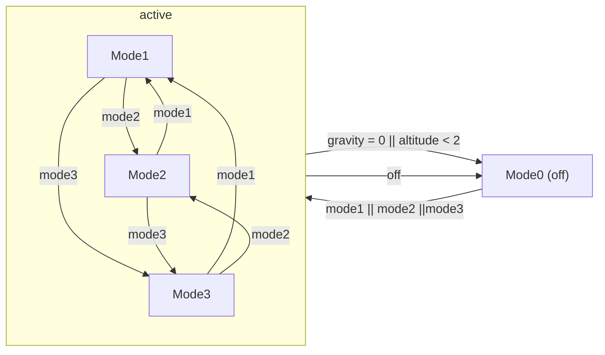
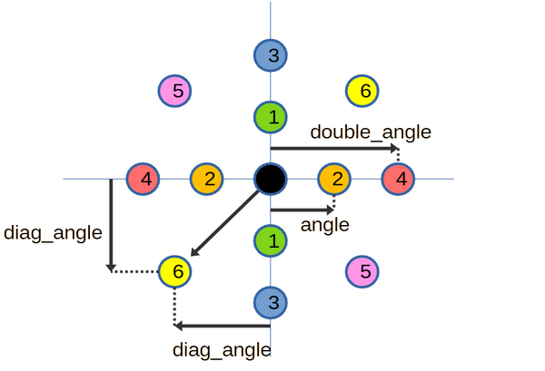
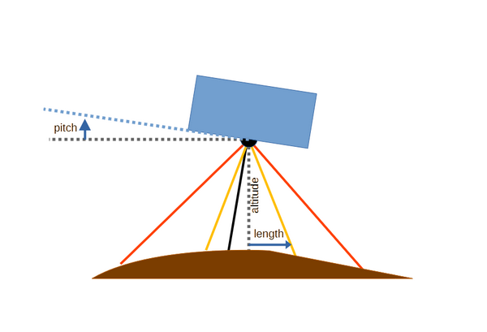

# Soft Landing Manager

## 1. Intro/General

This documents provides the technical information for the Soft Landing Manager script for Space Engineers by silverbluemx.

It is meant for those curious to understand how the script does what it does. In addition because of the limit that the game sets to ingame scripts (100 000 characters, including comments), the size of the script prevents extensive documentation in the comments, so most explanations will be added here.

## 2 Global logic

### 2.1 Modes management


## 2.2 Tasks sequencing

## 3. Speed set-point

### 3.1 Selection logic

In modes 1 and 2, the vertical speed set-point (speed that the ship tries to have) is continuously updated using the following methods depending on conditions:

|Altitude							|Landing Profile			|Method                                         |
|-----------------------------------|---------------------------|-----------------------------------------------|
|available & above transition		|computed & valid			|Detailed landing profile (see 3.2)             |
|available & above transition		|not computed or not valid	|Altitude/gravity formula (see 3.3)             |
|available & below transition		|-							|Constant final speed (see 3.5)                 |
|not available						|-							|Back-up formula using  local gravity (see 3.4) |

### 3.2 Landing profile

If the landing profile is computed and valid (see chapter 5), then it is simply a matter of looking up the speed corresponding to the current altitude, using interpolation between computed values.

### 3.3 Speed set-point explicit formula

#### 3.3.1 Formula
The formula for the speed set-point is derived assuming a time-reversed take-off with constant acceleration

Newton formula : 

$mass * acceleration = forces$\
$forces = lift - weight$\
$weight = mass * gravity$

Divide by mass:

$acceleration = \frac{lift}{mass} - gravity$\
$acceleration = (\frac{lift}{weight} - 1)*gravity$

If initial altitude and speed are zero, and we assume acceleration is constant:

$speed = acceleration * time$\
$altitude = 1/2 * acceleration * time^2$

Then solve for time as a function of altitude

$time = \sqrt{2 * \frac{altitude}{acceleration}}$
		
Substitude for time in the speed formula:

$speed = acceleration * \sqrt{2*\frac{altitude}{acceleration}}$\
$speed = \sqrt{2 * altitude * acceleration}$

Finally :

$speed = \sqrt{2 * altitude * (\frac{lift}{weight} - 1)*gravity}$

Because gravity, lift and weight are not actually constant, this formula provides an approximation
that is more and more incorrect at high altitude and thus margins must be applied here and there so
that the ship is capable of following the changes in the set-point.

#### 3.3.2 Lift-to-weight ratio target

To use the formula above, we need to compute the lift to weight ratio (LWR) that will be used to compute the vertical speed set-point. This is performed in the `UpdateLWRTarget()`method.

In mode 1:
- Only electric thrusters when their TWR is sufficient (ion + atmo TWR above `config.elec_LWR_sufficient = 2`)
- Use hydrogen thrusters at their maximum when needed (total TWR below `elec_LWR_start = 1.3`)
- Progressive transition between

In other modes:
- Allways all thrusters

When computing the vertical speed target, with the altitude/gravity formula the script uses a mix of the lift to weight ratio at the current altitude, and the expected lift-to-weight ratio at the planet surface. This setting defines the weight for the surface value (ex : 0.6 = 60% ground, 40% now). A high value gives a more cautious landing, a low value a faster and riskier one
`config.LWR_mix_gnd_ratio = 0.7`

The LWR target used to compute the speed target will be a mix of the target at the current conditions and at ground conditions.

If the pilot selected a planet type (with atmosphere or vacuum, or a precise planet in the catalog) we use only this one, otherwise if the planet is unknow then we consider the worst case between vacuum and full atmosphere.

### 3.4 Gravity formula

$vspeed_{sp} = -\frac{default}{grav_{now}/9.81}*(LWR_{target_{now}}-1)$

### 3.5 Final landing

Below the transition altitude, the vertical speed target is a constant.

`double transition_altitude = 20;`

`double final_speed = 1.5;`

# 4. Altitude

## 4.1 Selection logic

Update ship altitude (distance from surface) by combining altitude from controller (as shown on HUD) and radar (raytracing from ground-facing camera) as follows:

|Altitude from controller|Altitude from radar|Method                   |
|------------------------|-------------------|-------------------------|
|available 				 |available		     |Use radar altitude       |
|available 				 |not available      |Use altitude from surface|
|not available			 |available			 |Use radar altitude       |
|not available			 |not available		 |default value (1e6)      |

## 4.2 Radar Altitude


## 4.3 Altitude from surface

## 4.4 Altitude from sea level


# 5. Landing profile computation

This is implemented in the class `LiftoffProfileBuilder`

Build a liftoff profile for a ship, based on its characteristics and the planet it is on.
The profile is computed by simulating a liftoff from a standstill at a specified altitude above sea level.
It is then used to control the ship during the landing phase by looking up the vertical speed according to altitude.

A landing profile has two attribues :
- computed : if the profile has been computed or not
- valid    : if the computed profile concludes on a successfull liftoff, meaning that the vertical speed is always positive.

If the profile is computed but invalid, that means the ship is not capable of exiting the planet gravity well. It is however possible that the ship is capable of landing safely (ex : with a lot of atmopheric thrusters) but this landing profile cannot be used to control landing and a backup method will be needed.

Steps for computation are:
- Initial conditions : 0 vertical speed, altitude = ship at the surface
- Compute atmospheric density using the same simplified model as the game
- Compute the ship maximum lift from ion and atmospheric thrusters considering that density
- Compute the ship maximum lift from hydrogen thrusters
- If necessary, limit the total thrust according to configured acceleration and TWR limits (cut back on hydrogen first)
- Compute gravity using the same simplified model as the game
- Compute ship vertical acceleration : thrust/weight - gravity
- Compute ship vertical speed for some time step dt
- Compute the new ship altitude for some time step dt
- Repeat for 256 points

Then we use the altitude/speed table to interpolate (using binary search and linear interpolation) the speed set-point for any altitude value.

The profile is continuously updated based on detected conditions (planet estimated surface gravity and radius, detected atmosphere etc.). It should be pretty stable if the correct planet is selected in the catalog, but there may be more sudden change if the planet is unknown.

# 6. Planet surface gravity and radius estimation

## 6.1 Concept

In order to compute a landing profile, the script needs to know the parameters of the planet gravity well : planet radius, and surface gravity.

If the pilot selects a planet in the database, the surface gravity is known with certainty, otherwise it needs to be estimated. In any case, the planet radius must be estimated by the script (the player can spawn any planet with a radius of their choice : Pertam can have a radius of 120km, or 10km, or 300km with mods).

This function is implemented in the class `EarlySurfaceGravityEstimator`

## 6.2 Details

In Space Engineers (with the Real Orbits mod!) gravity works as follows:
- below $radius * hillparam$
$$
grav(alt_{sealevel}) = grav_{sealevel} ;
$$
- above $radius * hillparam$
$$
grav(alt_{sealevel}) = grav_{sealevel}  * {(\frac{MaxRadius}{alt_{sealevel}+radius})}^2;
$$
with :
$$
MaxRadius = radius  * (1  +  hillparam)
$$

Since the Programmable Block API always gives us the local gravity value, it is possible to sample the gravity at two different altitudes and compute the radius. We need to solve the equation for the unknown radius:

 $grav * (radius+alt)^2 = grav_{prev} * (radius+alt_{prev})^2$ 

Rearranging the terms for the usual form

$A*radius^2+B*radius+C=0$
 
$A = grav - grav_{prev}$

$B = 2*grav*alt - 2*grav_{prev}*alt_{prev}$

$C = grav*alt^2 - grav_{prev}*alt_{prev}^2$

We compute the delta as usual:

$delta = B^2 - 4*A*C$

$radius = \frac{-B + \sqrt{delta}}{2*A}$

At each call, use the new updated values for the computations and then push them to the old values for the next update

Once we have the radius, the seal level gravity is computed as follows:

$$
grav_{sealevel} = grav(alt_{sealevel}) * {(\frac{alt_{sealevel}+radius}{radius*(1+hillparam)})}^2
$$

## 6.3 Final selection

This is implemented in the `LandingManager.ComputeSurfaceGravityEstimate()` method.

If the pilot selected the planet from the database, it's easy ! We use the value from the database.

Otherwise, we have use the estimator but there's a trick. In Space Engineers, gravity becomes constant below some altitude, so the gravity estimator no longer works ! It will remember its best estimate, but if the script is started already at a low altitude, we won't have any value.

So, to finally select the expected ground gravity level :
- First, we compute a ground estimate, weighted with the estimator confidence (low confidence means we use some proportion of the current gravity)
- And at low altitudes, we mix unconditionnally the ground estimate with current gravity, starting from the altitude `config.gravTransitionHigh = 4000` until we purely use the current gravity at altitude `config.gravTransitionLow = 1000` and below.

# 7. GroundRadar

## 7.1 Concept

In Space Engineers, the Programmable Block API lets us retreive the altitude of the ship (above the ground or above sea level). However :
- It does not return a value at very high altitudes
- If the ship is landing on a landing pad (above ground) or in a silo (below ground), what we're instered in is the height above surface, not ground.

The  `GroundRadar` class therefore uses the raycast function of the camera block and casts a ray vertically below the ship to detect the exact distance to the surface, even at very long distances (200km).

In addition, by casting rays at an angle from the vertical direction (a bit foward, backward, left and right), it is possible to scan the terrain below and estimate the slope of the terrain below, to guide the ship to flat ground.

## 7.2 Single or Dual radar

In unmodded Space Engineers, the camera raycast charge rate is 2km/s. It means, we must wait 2 sec between each time we want to cast a ray 4km away, or 10sec to 20km etc.

In order to increase the refresh rate of the terrain scan, the script can use two independant radars (cameras) on the same ship.

With a single radar, it is used both for altitude measurement and terrain scanning. With two radars, the first is dedicated to altitude, the other to terrain scanning (with increased performance).

## 7.3 Altitude scan distance

When the script starts, the ground radar begins scanning at a range of `START_RANGE = 1000` meters.

If there is no return, the distance is doubled, and it tries again.

There is a maximum range of `config.radarMaxRange = 2e5` meters.

## 7.4 Terrain scan distance

The camera raycast charge rate is 2km/s
If called with tick10 (6 times per second), each tick lets us scan 2000/6 = 333m

### 7.4.1 With a single radar

If we have a single radar, it will be used for both altitude and terrain
	
The altitude scan has priority (`ScanForAltitude()` is called before `ScanTerrain()`) and will use all available scan range above an altitude X when X+RANGE_INCREMENT = 333m

Below that, we will accumulate $333m - (alt+RANGE_INCREMENT)$ of range per tick to scan for terrain.

A terrain scan that begins Y meters above the ground and with a range of Y meters uses 4 scans, therefore uses 4 x Y meters of range.

The maximum number of ticks between each terrain scan is therefore $\frac{4*Y}{ (333m - (Y+RANGE_INCREMENT))}$

For range increment of 50m, and Y=180m, this is 6.9 ticks

This is almost one per second, and sufficient, so we set `MAX_TERRAIN_DISTANCE_SINGLE_RADAR = 180`

### 7.4.2 With two radars

If we have two radars, the first one will be used for altitude and the second one is entirely dedicated for terrain. We can then make various range/refresh rate compromises.

## 7.5 Terrain scan pattern

The terrain is scanned progressively, by casting rays in pairs, as shown on the diagram below (this represents a top-down view, with the black dot showing the vertical). 

If the ship has a single radar, shared with altitude measurement, then only pairs 1 and 2 are used (`ScanMode.SingleNarrow`), to maintain an acceptable refresh rate. So, each the radar has enough charge, the scripts casts the two rays of a pair, alternating between pair 1 and 2.

With dual radars, the script also begins with only pair 1 and 2 (`ScanMode.DoubleEarly`) but at a much higher altitude  (`DOUBLE_RADAR_INITIAL_SCAN_DISTANCE = 5000`).
Once close enough to the ground (`DOUBLE_RADAR_WIDE_SCAN_DISTANCE = 1000`), it activates all other pairs and scans in a sequence 1, 2, 3, 4, 5, 6, 1, 2, 3 etc. (`ScanMode.DoubleWide`). That way, it is able to get a better view of the terrain slopes below the ship, and aim more accurately.



## 7.6 Terrain scan angle

The rays are cast at an angle from the vertical in order to scan a fixed distance below the ship (`GROUND_SCAN_HORIZ_LENGTH = 20` meters). So, the scan angle is small at high altitudes and becomes wider at lower altitudes. Raycast angle take ship pitch and roll into account to always properly refer the angle to the vertical. The formula is simply:

$angle = Atan(\frac{length}{altitude})$

A minimum angle is applied : `MIN_SCAN_ANGLE = 2` so that at high altitude we scan the terrain more broadly, to find larger features.

A maximum angle is applied, particularly to reduce the risk of the ray hitting the ship itself at low altitudes : `MAX_SCAN_ANGLE = 30`

These limits are applied to all pairs, 1 to 6, so at very low altitudes, pairs 1 and 3 cast to the same angle, and pairs 2 and 4 also.



## 7.7 Horizontal speed recommandation

The  `GroundRadar` class includes methods `RecommandFwdSpeed()` and `RecommandLeftSpeed()` that analyze the terrain scan results and recommand a forward and lateral speed to guide the ship in the direction of downward slope, and find the lowest possible (local) terrain.

The aims are:
- more vertical distance mean more margin for the landing burn
- ships with atmospheric thrusters will benefit from the thicker atmosphere closer to sea level
- we hope to find flat terrain, more suited for landing, at the bottom of the slope

In order to do that, it evaluates independantly the slope along each of the directions defined by the scan pairs (1, 2, 3 etc. see above) and combine them in a global forward/backward speed set-point and left/right speed set/point. A maximum value (`HORIZ_MAX_SPEED = 20`) is applied to avoid dangerous speeds.

# 8. Thruster management

## Mode 1 settings
In mode 1, if the absolute value of the vertical speed is higher than this limit and the ship is above this altitude, then ion thrusters will be set to completely compensate the ship weight (if they are capable)

`public readonly double early_ion_alt_limit = 2000;`

`public readonly double early_ion_speed_limit = 100;`

In mode 1, the ship evaluates if electric thrusters (ion and atmospheric) are sufficient on their own to land, otherwise it uses the hydrogen thrusters as well.
	
LWR of the electric thrusters when they start to be prioritized

`public readonly double elec_LWR_start = 1.3;`

LWR of the electric thrusters when they are considered sufficient

`public readonly double elec_LWR_sufficient = 2;`

`public readonly double atmo_mode1_speed = 10;`

# 9. Ship leveling

This is implemented in the `AutoLeveler` and `GyroController` classes.

They manage ship orientation (pitch and roll) to achieve a desired forward and lateral speed.

Most of the code is directly taken from Flight Assist by Naosyth (copy of a lot of the "Hover Smart" mechanism, simplified for the purpose of this script) :
- the `AutoLeveler` class evaluates the difference between the current horizontal speeds (forward and lateral) and their respective set-point, and computes a target ship pitch and roll to reach the targets
- the `GyroController` class controls the overrides of the ship gyroscopes to achieve these pitch and roll angles
- the script detects when the pilot tries to move the ship directly, and disables the overrides so that the pilot has authority for a short time

# 10. Horizontal thrust

This is implemented in the `HorizontalThrusters` class.

It manages the ship manoeuvering thrusters (forward, backward, to the left and right) to achieve a desired forward and lateral speed.

It uses two PID controllers fed with the difference between the current horizontal speeds (forward and lateral) and their respective set-point, and computes a target thrust for each manoeuvering thrusters group to reach the targets.

A small dead zone is used to avoid making excessively many small corrections.

# 11. Thruster group

# 11.1 Concept

The `ThrGroup` implements the notion of a thruster group that all provide thrust in the same direction. That way, when another function of the script requests some amount of thrust (with the `ApplyThrust()`method), it is possible to begin by using the electric (ion and atmospheric) thrusters up to their limit, before adding the tank-depleting hydrogen thrusters.

It also provides other helpful methods to evaluate the capabilities of the thruster group.

# 11.2 Thruster sorting

When the script is compiled, the constructor of this class takes the list of thrusters and fits them in the 3 groups : hydrogen, ion, or atmospheric. Therefore, this is where support for custom/modded thrusters shoud be added.
```
// Separate thruster by type
// Add custom/modded thrusters here if needed
foreach (var thr in thrusters) {
    string name = thr.DefinitionDisplayNameText.ToString();
    if (name.Contains("Hydrogen") || name.Contains("Epstein") || name.Contains("RCS")) hthrusters.Add(thr);
    else if (name.Contains("Ion") || name.Contains("Prototech")) ithrusters.Add(thr);
    else if (name.Contains("Atmo")) athrusters.Add(thr);
}
```
# 12 Misc classes

# 12.2 Data logger

The `Logger` class provides the capability to record internal variables of the script over time, and output them in CSV format into the Programmable Block custom data. They can be graphed with Excel, Matlab etc. for analysis.

# 12.3. Runtime counter

TODO

# 12.4 Helpers

TODO

# 12.5 PID

TODO

# 12.6 Ship information

TODO

# Appendix A. Planet Catalog

The default planet (unknown) is defined here as having a thick atmosphere to lower ion effectiveness but because it is unknown then the script will also completely ignore atmospheric thrusters capability.
For the generic atmo planet we assume a moderately dense atmosphere but that doesn't go as high as Earthlike.

The planet catalog is as follows :

The following are the vanilla planets of space engineers. Values are read directly from the .sbc files (PlanetGeneratorDefinitions.sbc or Pertam.sbc or Triton.sbc)

| Shortname  | Name                          | Atmo Density (Sea Level) | Atmo Limit Altitude | Hill Parameter | Gravity (Sea Level) | Ignore Atmo | Identified |
|------------|--------------------------------|--------------------------|---------------------|----------------|----------------------|-------------|------------|
| unknown    | Unknown Planet                 | 1                        | 2                   | 0.1            | 1                    | ✅          | ❌         |
| vacuum     | Generic Vacuum Planet          | 0                        | 0                   | 0.1            | 1                    | ❌          | ❌         |
| atmo       | Generic Atmo Planet            | 0.8                      | 1                   | 0.05           | 1                    | ❌          | ❌         |
| pertam     | Pertam                          | 1                        | 2                   | 0.025          | 1.2                  | ❌          | ✅         |
| triton     | Triton                          | 1                        | 0.47                | 0.20           | 1                    | ❌          | ✅         |
| earth      | Earthlike                       | 1                        | 2                   | 0.12           | 1                    | ❌          | ✅         |
| alien      | Alien                           | 1.2                      | 2                   | 0.12           | 1.1                  | ❌          | ✅         |
| mars       | Mars (vanilla)                  | 1                        | 2                   | 0.12           | 0.9                  | ❌          | ✅         |
| moon       | Moon (vanilla)                  | 0                        | 1                   | 0.03           | 0.25                 | ❌          | ✅         |
| europa     | Europa                          | 0.5                      | 1                   | 0.06           | 0.25                 | ❌          | ✅         |
| titan      | Titan                           | 0.5                      | 1                   | 0.03           | 0.25                 | ❌          | ✅         |


Below are additional planets from mods or custom planets that I like a lot

| Shortname  | Name                          | Atmo Density (Sea Level) | Atmo Limit Altitude | Hill Parameter | Gravity (Sea Level) | Ignore Atmo | Identified |
|------------|--------------------------------|--------------------------|---------------------|----------------|----------------------|-------------|------------|
| komorebi   | Komorebi                        | 1.12                     | 2.4                 | 0.032          | 1.14                 | ❌          | ✅         |
| orlunda    | Orlunda                         | 0.89                     | 6                   | 0.01           | 1.12                 | ❌          | ✅         |
| trelan     | Trelan                          | 1                        | 1.2                 | 0.1285         | 0.92                 | ❌          | ✅         |
| teal       | Teal                            | 1                        | 2                   | 0.02           | 1                    | ❌          | ✅         |
| kimi       | Kimi                            | 0                        | 1                   | 0              | 0.05                 | ❌          | ✅         |
| qun        | Qun                             | 0                        | 1                   | 0.25           | 0.42                 | ❌          | ✅         |
| tohil      | Tohil                           | 0.5                      | 1                   | 0.03           | 0.328                | ❌          | ✅         |
| satreus    | Satreus                         | 0.9                      | 1.5                 | 0.04           | 0.95                 | ❌          | ✅         |
| pyke       | Pyke                            | 1.5                      | 2                   | 0.06           | 1.42                 | ❌          | ✅         |
| saprimentas| Saprimentas                     | 1.5                      | 2                   | 0.07           | 0.96                 | ❌          | ✅         |
| aulden     | Aulden                          | 1.2                      | 2                   | 0.10           | 0.82                 | ❌          | ✅         |
| silona     | Silona                          | 0.85                     | 2                   | 0.03           | 0.64                 | ❌          | ✅         |
| argus      | Argus                           | 0.79                     | 2                   | 0.01           | 1.45                 | ❌          | ✅         |
| aridus     | Aridus                          | 1.3                      | 1                   | 0.1            | 0.5                  | ❌          | ✅         |
| microtech  | Microtech                       | 1                        | 0.5                 | 0.25           | 1                    | ❌          | ✅         |
| hurston    | Hurston                         | 1                        | 1.9                 | 0.11           | 1.1                  | ❌          | ✅         |
| terra      | (Terra) Earth by Infinite       | 2                        | 0.9                 | 0.02           | 1                    | ❌          | ✅         |
| luna       | Luna by Infinite                | 0                        | 1                   | 0.07           | 0.16                 | ❌          | ✅         |
| sspmar     | Mars by Infinite                | 0.006                    | 2                   | 0.09           | 0.38                 | ❌          | ✅         |
| venus      | Venus by Infinite               | 92                       | 2                   | 0.04           | 0.9                  | ❌          | ✅         |
| mercury    | Mercury by Infinite             | 0                        | 1                   | 0.1            | 0.37                 | ❌          | ✅         |
| ceres      | Ceres by Infinite               | 0                        | 0.5                 | 0.1            | 0.05                 | ❌          | ✅         |
| helghan    | Helghan                         | 1.2                      | 3.5                 | 0.01           | 1.1                  | ❌          | ✅         |
